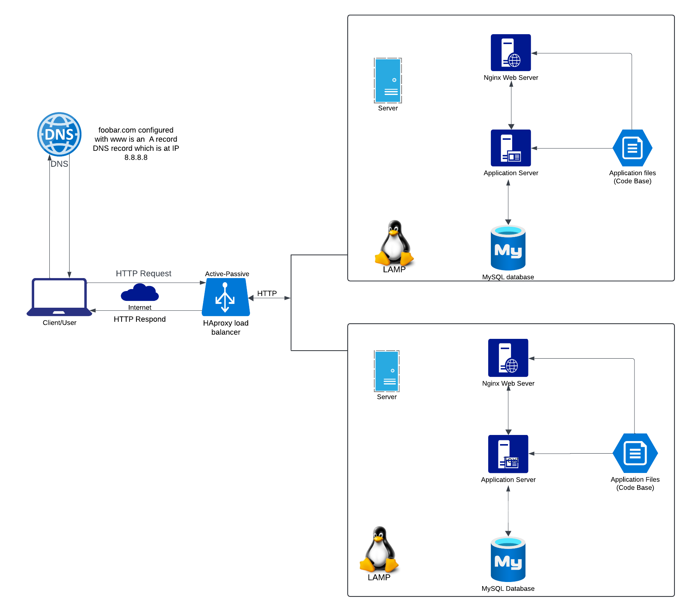

# Distributed web infrastructure

[view whiteboard](https://imgur.com/a/vgPR3Mr)

## Task Description
This is a project that describes a distributed web framework hosting a website accessible through 'www.foobar.com'. The server lacks both firewall and SSL certifcates to safeguard its network. The aim of this is to reduce the traffic to the primary server by distributing some load to a replica server with the aid of a load balancer server. The following are the requirements of this distributed web infrastructure;
- 2 servers
- 1 web server (Nginx)
- 1 application server
- 1 load-balancer (HAproxy)
- 1 set of application files (your code base)
- 1 database (MySQL)

## Explanation of the Infrastructure specifics
- **Load Balancer(What distribution algorithm your load balancer is configured with and how it works?)**  
A load balancer distributes network traffic accross different servers. The load balancer used here is the HAproxy load balancer which is configured with the Round Robin distribution algorithm, which ensures equitable distribution of processing time among servers based on their weights. This is a flexible distribution algorithm which permits real-time adjustments to server weights.
- **Load Balancer High Availability Clustering(Is your load-balancer enabling an Active-Active or Active-Passive setup, explain the difference between both?)**  
High Availability clustering is a strategy used in computer systems to ensure uninterrupted availability of services and applications thereby minimizing downtime. The Load balancer (HAproxy) in this web framework implements an Active-Passive setup as opposed to the Active-Active setup. The major difference between the two types of setup is that the Active-Active setup distributes workloads across all nodes to prevent overload on a single node while in the Active-Passive setup, not all nodes are consistently active, there is one or several active nodes and there is one or several passive nodes which become active when the active node becomes inactive.
- **Database(How a database Primary-Replica (Master-Slave) cluster works?)**  
Due to the presence of two servers in this distributed web framework, there is a primary database and a replica database, where the primary database performs read-write requests and the replica server performs read requests alone. However synchronization of data occurs whenever the primary server executes a write operation.
- **Primary and Replica node(What is the difference between the Primary node and the Replica node in regard to the application?)**  
The major difference between the primary node server and replica node is that the primary node handles all write operations of the website while the replica node handles read operations, hence reducing read traffic directed towards the primary node.

## Issues with this distributed web infrastructure
- **SPOF(Where are SPOFs?)**  
This distributed web infrastructure faces several Single Points of Failures(SPOF). An example is the a downtime in the primary database, if this occurs, the entire site is incapable of adding and removing users or making any sort of change. Also the downtime in the load balancer also becomes an SPOF.
- **Security issues (no firewall, no HTTPS)**  
The web framework is faced with security concerns such as lack of encryption in the network data transmission this is due to the absence of an SSL certificate. There is also an absence of a firewall on the servers which gives access to unauthorized IPs.
-- **Monitoring (no monitoring)**
There is no monitoring of the server, so the status is unknown
